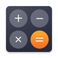

<h1>Calculator</h1>
<h2>A simple Calculator App which Performs basic calculations such as addition, subtraction, multiplication, division. Created this app in Android Studio using Kotlin Language.</h2> 
<h1>App Logo</h1>

# App in Action
[View App in Action Here](https://www.linkedin.com/feed/update/urn:li:activity:6721870213295484928/)
